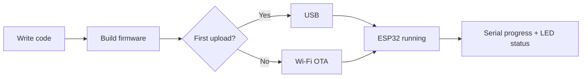

# ESP32 OTA Firmware

Turn an ESP32 into a device you can update from your desk.

This project is a small, expandable firmware foundation with Wi-Fi, a
password-protected ArduinoOTA service, serial progress reporting, and an LED
heartbeat. Once the first upload is done over USB, future firmware updates can
travel over the network.



## Why this project?

Physical access is useful during development. It becomes a burden when the
board is inside a robot, enclosure, or installation. OTA gives this firmware a
simple upgrade path:

```text
Write code -> build -> upload over Wi-Fi -> watch progress -> keep building
```

The onboard LED shows the device state: a heartbeat while idle, and update
activity while a firmware transfer is in progress.

## Features

- ESP32 Arduino firmware
- Wi-Fi station-mode startup
- Password-protected OTA updates
- OTA progress and error messages over Serial
- LED heartbeat and update indication
- PlatformIO build configuration
- Arduino IDE entrypoint retained
- GitHub Actions build on pushes and pull requests
- Version metadata for repeatable releases

## Quick start

### 1. Configure credentials

Update the local values in `src/ota_basic.ino`:

```cpp
const char* ssid = "your-wifi-name";
const char* password = "your-wifi-password";
```

Do not commit real Wi-Fi or OTA passwords to a public repository. Use local
configuration or CI secrets as the project grows.

### 2. First upload over USB

Install the ESP32 board package, connect the board, select the correct board
and serial port, then upload the firmware once over USB.

### 3. Check the device

Open Serial Monitor at `115200` baud. After Wi-Fi connects, the firmware prints
the device IP address. Keep that address available for the next upload.

### 4. Upload over Wi-Fi

Use PlatformIO or Arduino IDE to select the ESP32 network port, then upload a
new build. The OTA password is required when prompted.

## Build with PlatformIO

Install PlatformIO, then run:

```bash
pio run
```

The project targets the `esp32dev` board and uses the Arduino framework. The
same build runs automatically in GitHub Actions.

## Open with Arduino IDE

Open the root-level file `ota_basic.ino` in Arduino IDE:

```text
ota_basic/ota_basic.ino
```

Select an ESP32 board and port, then verify or upload. The root sketch is the
Arduino IDE entrypoint; the maintained implementation remains under `src/`
and `include/`.

## Project map

```text
src/
  ota.cpp             OTA setup, callbacks, and LED state
include/
  ota.h               OTA public interface
  config.h            Shared configuration state
  version.h           Firmware version
releases/
  version.txt         Current release version
build/                Local generated build output
ota_basic.ino       Main application
platformio.ini        PlatformIO configuration
.github/workflows/    Continuous integration
```

The layout is ready for future modules such as sensors, servos, motor
control, and robot navigation without turning the main sketch into one large
file.

## Release checklist

1. Test the firmware over USB and OTA.
2. Update `FIRMWARE_VERSION` in `include/version.h`.
3. Update `releases/version.txt` to the same value.
4. Run `pio run`.
5. Tag the release, for example `v1.0.0`.

GitHub Actions verifies that the project still builds on every push and pull
request.

## Roadmap

- Move credentials to a local untracked configuration file.
- Add sensor and servo modules under `src/` and `include/`.
- Attach compiled firmware binaries to tagged GitHub Releases.
- Add automated hardware smoke tests.

## License

See the source files for the existing Espressif license notice.